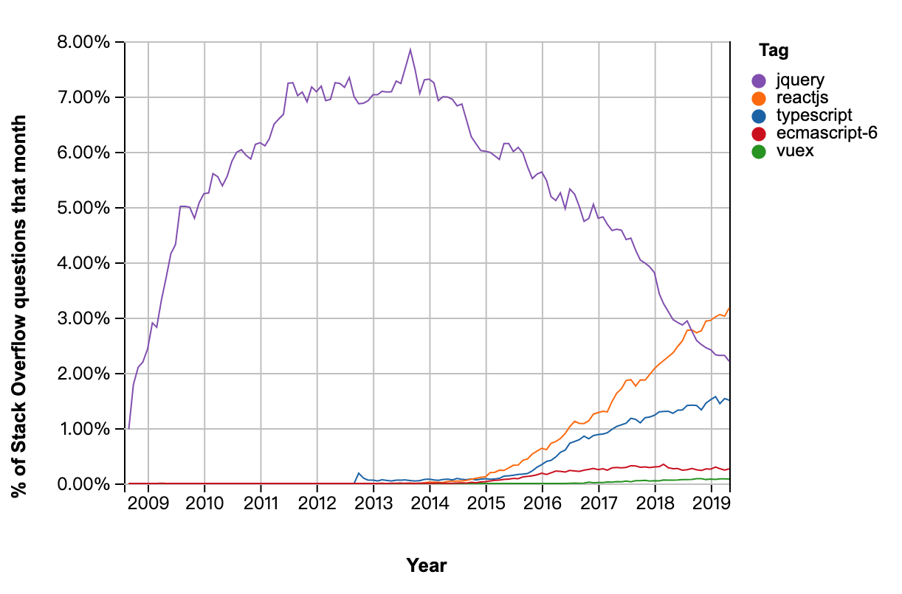

# Typescript 笔记和小书源代码

## 笔记

这里我会将章节来作为版本来管理，以便一步一步留痕操作，便于阅读和逐渐深入学习（个人学习方法）。

## 小书

### Typescript 为什么选择她

近3年，这家伙很火。🔥 到什么程度？一度没朋友，一度让我心头热了（冷笑话）

#### 感性选择（内驱和兴趣使然）

就我来说，我还是一个不太理性的前端，截止到今年，看到哪门语言火热就去凑个热度，然后学学就丢了。3月份加入掘金，就暗暗给自己作了一个规划**前端知识沉淀**。其实也是在自我约束，约束那颗散漫（懒散又漫无目的）的心，要安安静静地做好一件事然后再去做下一件事。

其实 Typescript 基本语法已经撸过一遍，只是一直未在项目中实战，所以又丢了（这个毛病得改，改后还是好前端）。这次决心学并用，是因为本来是想**解读 React 16.8.6 源码**的，可是源码是 Typescript 写的，脑袋翁的一声，只好转头瞄准她了。不可否认，Typescript 本身的魅力也有吸引我，再加上自己也想在 React 项目中将她付诸于实践。综合了这 3 点决定**干（是学）！！！**。

#### 理性选择（数据说话）

希望下面几个有影响力的数据趋势站点，能点燃你学习 [Typescript][] 的兴趣。当然了，现在她还不是一门非必学语言。

##### Google Trends

第1组就是来自 [Google Trends][] 。题外话，如果你想了解一个或多个事物或技术的发展趋势，[Google Trends][] 是个不错的工具。

这里拿了近3年比较🔥的前端新贵（这里有一个是传统新贵）来做对比的（按火热程度的纬度来对比，虽然她们性质和使用场景的可比性不大），主要目的是想让正在阅读的你有个初步了解，[Typescript][] 是一种趋势。

##### Stack Overflow Treads

第2组来自我们熟悉的 [Stack Overflow Treads][]。题外话，Stack Overflow 就是那个遇到任何技术问题都可以去找答案的问答社区。

##### The State of JS
第3组报告来自 The State of JS 

#### 终于

感性的认识和理性的选择都推动着去学习和应用，那就来吧。

### Typescript 精彩履历

> 本章节和后续章节都以 Typescript 的口吻自述，就是这么自信（自恋）。

兵法云：知己知彼，百战不殆（语出《孙子·谋攻篇》）（一个前端开始聊兵法，瞎搞，凑字数）。引用此，是想说，要用我就先看看我漂亮履历吧。

#### 自我介绍

我是 Microsoft 公司注册商标（来头大，后台硬）。

我是 JavaScript 的一个超集，主要提供**类型系统**和**对 ES6 的支持**。

我可以编译成纯的 JavaScript 代码，支持任意浏览器，任意环境，任意系统并且是开源的，[开源于 GitHub](https://github.com/Microsoft/TypeScript) 上。

我还在不断的完善中，会不断有新的特性加进来，所以你得时常关注我的成长。

> 如果你对我一见钟情，那就好好了解熟悉我；
> 
> 如果你对我爱的山无棱天地合，那就在项目中应用我；
> 
> 如果你对我没感觉，那继续回去写你的 Javascript 吧。

#### 我好在哪里

##### 增强代码的可读性和可维护性

- 在编译阶段就可以发现大部分错误，总比在运行时候出错好，你说呢？
- 类型系统是最好的文档，大部分的函数看看类型的定义就可以知道如何使用了；
- 增强了编辑器和 IDE 的功能，比如代码补全、接口提示、跳转到定义、重构等；

##### 我有包容心

- `.js` 文件可以直接重命名为 `.ts` 即可;
- 可以定义从简单到复杂的几乎一切类型;  
- 即使不显式的定义类型，也能够自动做出类型推论;
- 即使在我这边编译报错，也可以生成 JavaScript 文件;
- 兼容第三方库，即使第三方库不是用我写的，也可以编写单独的类型文件给我读取;

##### 拥有强大活跃的社区

- 符合 ES6 规范，也支持部分 ESNext 草案的规范（有眼光）；
- 大部分第三方库都有提供给我的类型定义文件（圈内有名，后台硬）;
- Google 开发的 Angular2 就是用我来编写的（傲娇）;
- ...

##### 当然了，我也不是完美的

- 学习并熟悉我是需要一定的学习成本的，你需要了解什么是接口（Interfaces）、泛型（Generics）、类（Classes）、枚举类型（Enums）等前端工程师不是很熟悉的概念和定义;
- 短期会增加开发成本，要多写一些类型的定义，不过对于长期维护的项目，用我了就能够减少维护成本;
- 集成到构建流程需要工作量;
- 和一些库结合的还不是很完美（其实，不完美也是一种美）;

#### 客观地说

本章最后，我想对你说的是：根据公司、项目和团队等各种情况综合判断是否选择使用我，我是很有包容心的。

## You can

[前端知识沉淀](https://juejin.im/post/5d0878aaf265da1b83338f74?utm_source=gold_browser_extension)

[Google Trends]: https://trends.google.com/trends/explore?date=2016-05-19%202019-06-19&geo=CN&q=typescript,es6,react,vue,jquery
[Stack Overflow Treads]: https://insights.stackoverflow.com/trends?tags=typescript%2Creactjs%2Cvuex%2Cecmascript-6%2Cjquery
[Typescript]: http://www.typescriptlang.org/

