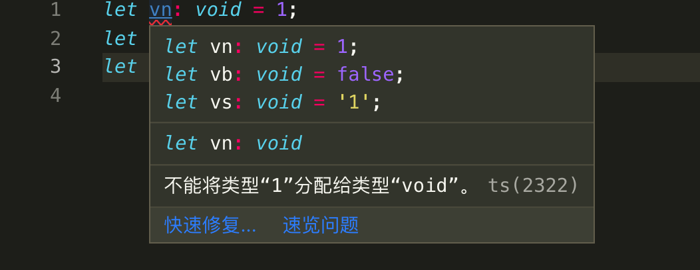
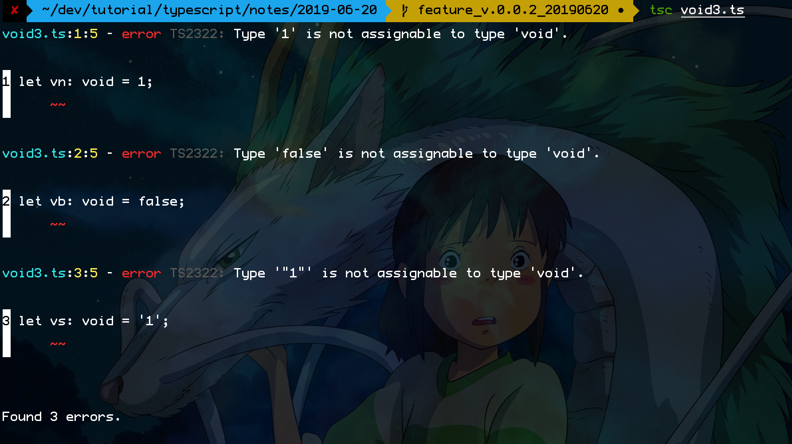

# 空值

在 JavaScript 的世界里是没有**空值**的概念，但在 TypeScript 中，可以用 `void` 表示没有任何返回值的函数。

```typescript
// void.ts
function sayTs(): void {
    console.log('Hello, Typescript');
}

function sayTs2(): void {
    return 'Hello, Typescript';
}
```

编译前


编译后


但还是编译出来了

```javascript
// void.js
function sayTs() {
    console.log('Hello, Typescript');
}
function sayTs2() {
    return 'Hello, Typescript2';
}
```

> 问：`void` 与 `null`（或`undefined`）间关系如何？

```typescript
// void2.ts
let u: void = undefined;
let n: void = null;
```

编译后

```javascript
// void2.js
var u = undefined;
var n = null;
```

> 问：`void` 与 `string`(`number`、`boolean`)关系如何？

```typescript
// void3.ts
let n: void = 1;
let b: void = false;
let s: void = '1';
```

编译前



编译后



但还是编译出来了

```javascript
// void3.js
var vn = 1;
var vb = false;
var vs = '1';
```

总结下，只能将 `undefined`、`null` 和没有返回值的函数赋值给 `void`（空值）类型。
